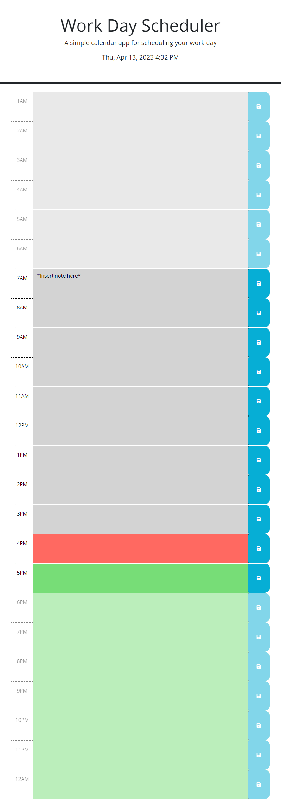

# 05-Third-Party-APIs-Challenge-Work-Day-Scheduler

## Description

created planner for use to record notes, check time, and see color labeled hour blocks to update using third party APIs. 
I learned how to link 3rd party APIs to a doc and implement their abilities to style and create useful functions for a webpage. 

## Link 
[link](https://meister7k.github.io/05-Third-Party-APIs-Challenge-Work-Day-Scheduler/)

## screenshot

## Cited
none
